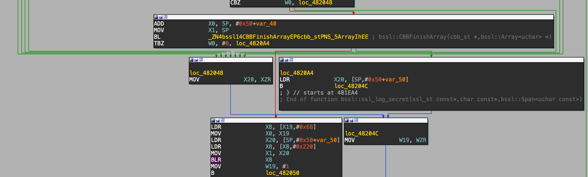

+++
title = "Intercepting Android\'s Encrypted Traffic: Hooking BoringSSL with friTap"
date = 2025-02-28T17:43:13+01:00
description = "How to use BoringSecretHunter to facilitate hooking BoringSSL with friTap"
author = "Daniel Baier"
tags = ["TLS", "TLS Decryption"]
keywords = ["SIEM", "ThreatDetection", "Sigma"]
toc = false
showFullContent = false
draft = false
+++

## Introduction

## BoringSecretHunter

## friTap

## Example

